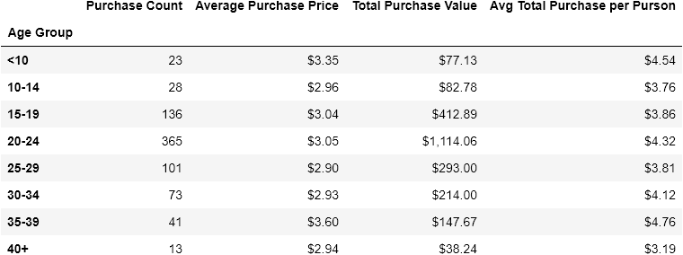

# University of Denver Data Analytics Boot Camp: Python-Pandas Challenge

This assignment consists of analyzing data from a video game called "Heroes of Pymoli". The analysis is done using Pandas to create and manipulate data frames looking for valuable information comparing player demographic info and purchase habits.

Your final report should include each of the following:

### Player Count

* Total Number of Players

### Purchasing Analysis (Total)

* Number of Unique Items
* Average Purchase Price
* Total Number of Purchases
* Total Revenue

### Gender Demographics

* Percentage and Count of Male Players
* Percentage and Count of Female Players
* Percentage and Count of Other / Non-Disclosed

### Purchasing Analysis (Gender)

* The below each broken by gender
  * Purchase Count
  * Average Purchase Price
  * Total Purchase Value
  * Average Purchase Total per Person by Gender

  

### Age Demographics

* The below each broken into bins of 4 years (i.e. &lt;10, 10-14, 15-19, etc.)
  * Purchase Count
  * Average Purchase Price
  * Total Purchase Value
  * Average Purchase Total per Person by Age Group

  

### Top Spenders

* Identify the the top 5 spenders in the game by total purchase value, then list (in a table):
  * SN
  * Purchase Count
  * Average Purchase Price
  * Total Purchase Value

  

### Most Popular Items

* Identify the 5 most popular items by purchase count, then list (in a table):
  * Item ID
  * Item Name
  * Purchase Count
  * Item Price
  * Total Purchase Value

 

### Most Profitable Items

* Identify the 5 most profitable items by total purchase value, then list (in a table):
  * Item ID
  * Item Name
  * Purchase Count
  * Item Price
  * Total Purchase Value

  

# Conclusions and Observable Trends 
  * Males are more likely to make purchases for the game. This is evident in the Gender Demographics table which shows that 84.03% of all purchases are from males.
  * People in the age range of 20-24 are more likely to make purchases. This is shown in the Age Demographics table wih 44.79% of all purchases in this age range
  * The top 2 most popular items purchased are Final Critic and Oathbreaker, Last Hope of the Breaking Storm. This is shown in the Most Popular Items table with purchase counts of 13 and 12 respectively for each of the 2 items.

